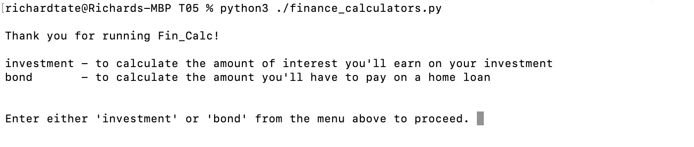
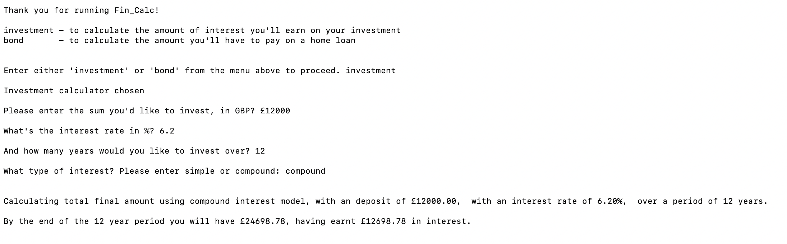

# finalCapston
 Final Capstone Project

 Richard Tate - 27/04/2023  (RT23010006855)

This is the final capstone project for the HyperionDev Data Science Bootcamp - Cohort 4.  
It includes the previous capstone project completed as part of the bootcamp.

### Contents
T05 - finance_calculators.py

Finance Calculators allows a user to use two different financial calculators: an investment calculator and a home loan repayment calculator.  The user initially has two choices, investment or bond.  Investment calculates interest on a sum of money invested over a term, and bond calculates monthly mortgage payments on a sum borrowed against a house.

* investment - input money invested, interest rate and the number of years investing over and either simple or compound interest.
* bond - input the value of the house, the interest rate, and the number of months repayments will be over.

### Installation
finance_calculators.py file can installed locally, with the following library dependencies: `math`

### Useage
Simple to use, all instructions are given when the program is run.  Money, percentage and months / years should be entered in integers.  There is no need to use % symbol for the percentage figures.

### Credits
Just me 😀
